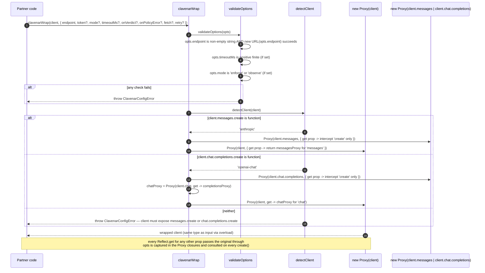
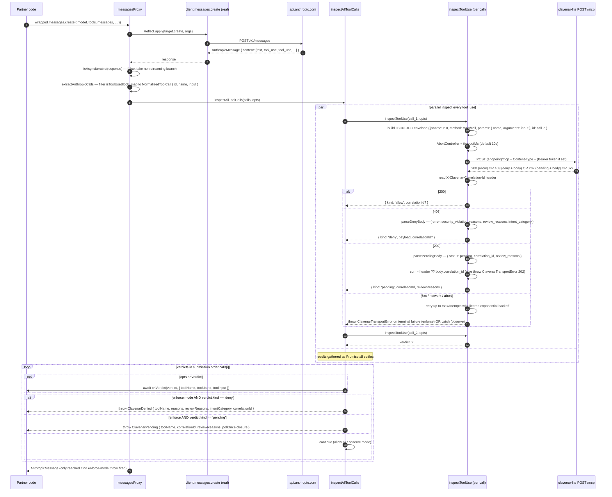
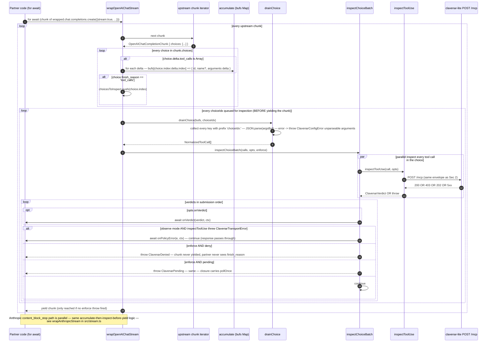
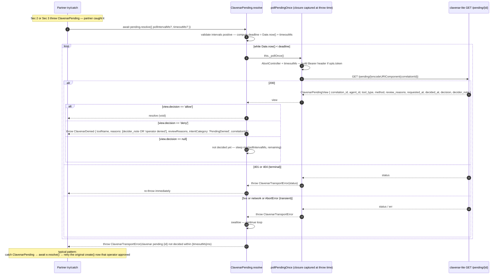
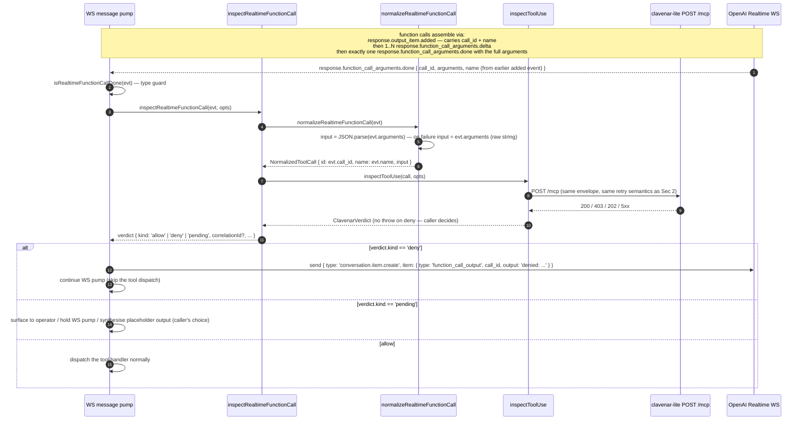
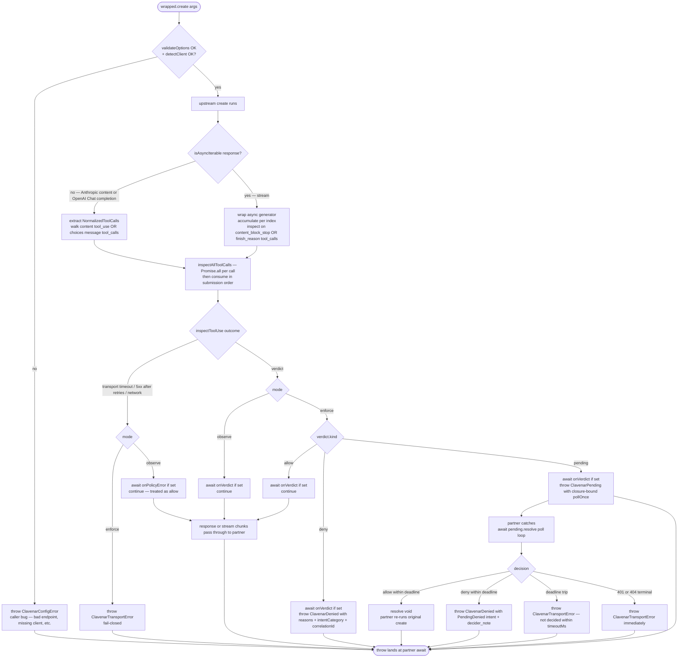

# clavenar-ai-sdk sequence diagrams

Five sequence diagrams cover the wire-level paths the SDK can take:
`clavenarWrap` boot + structural client detection, the non-streaming
inspection of an Anthropic response (the OpenAI Chat path is the same
shape against `chat.completions.create`), the streaming OpenAI Chat
choice-end gate (Anthropic's `content_block_stop` parallels it), the
`ClavenarPending.resolve` polling loop, and the standalone
`inspectRealtimeFunctionCall` helper for the OpenAI Realtime WS
surface. A request decision-tree flowchart closes the file.

The SDK is a transparent client of `clavenar-lite`'s `POST /mcp` +
`GET /pending/{id}` surface — the diagrams treat the partner's model
client, `clavenar-lite`, the agent's tool loop, and (for Realtime) the
WS handler as the cross-process boundaries.

## 1. `clavenarWrap` — boot, validate, detect, install nested Proxies

`clavenarWrap` runs once per client. It validates the option bag,
walks the client structurally to pick a provider shape (Anthropic if
`messages.create` exists, OpenAI Chat if `chat.completions.create`
exists), then installs nested `Proxy` handlers so only `create` is
intercepted — every other property (`client.beta`, `client.models`,
custom subclasses) passes through `Reflect.get` unchanged.

## 2. Non-streaming Anthropic — extract tool_use, inspect in parallel, throw in order

When the partner awaits `wrapped.messages.create({...})`, the
intercepted `create` calls upstream, walks `content[]` for
`tool_use` blocks, normalises them, and `Promise.all`s an
`inspectToolUse` per call. Verdicts are then consumed in submission
order — the first deny / pending in `calls[]` is the one that
throws, not the first to come back over the wire — so two parallel
denies always produce the same `ClavenarDenied.toolName` deterministically.

## 3. Streaming OpenAI Chat — hold `finish_reason: tool_calls` until inspection clears

The wrapper is an async generator that mirrors upstream chunks
one-for-one and accumulates `tool_calls` arguments per
`choiceIndex:toolIndex`. When a chunk's `choice.finish_reason ==
'tool_calls'` arrives the wrapper inspects every accumulated call in
that choice — concurrently via `Promise.all` — and then yields the
finishing chunk. A deny in enforce mode throws *before* the partner
sees `finish_reason: 'tool_calls'`, so the upstream tool-execution
loop is never triggered for the blocked call.

## 4. `ClavenarPending.resolve` — poll until decided, terminal vs transient errors

When enforce mode throws `ClavenarPending`, the partner catches it,
runs whatever side-work makes sense during the wait, then calls
`await pending.resolve(...)`. `resolve` polls
`GET /pending/{correlationId}` every `pollIntervalMs` (default 2s)
until the operator decides or the wall-clock deadline (default 10
min) trips. Terminal transport failures (401, 404) re-throw
immediately; transient ones (5xx, network blips) are swallowed
between polls.

## 5. OpenAI Realtime — one-shot `inspectRealtimeFunctionCall`

The Realtime API is websocket-based; there is no client-method shape
for `clavenarWrap` to intercept. Instead the SDK exposes a standalone
helper the partner's WS message pump calls when a
`response.function_call_arguments.done` event arrives. The helper
normalises the event (parsing the JSON-encoded `arguments` string,
falling back to the raw string on parse failure so clavenar can still
inspect the malformed-args attempt) and runs one `inspectToolUse`.

## 6. Request decision tree (flowchart)

A single `create()` invocation through the wrapped client fans out
across four orthogonal knobs: response shape (sync vs stream),
per-call verdict, enforcement mode, and transport health. The
flowchart captures the final outcomes — pass-through, `ClavenarDenied`,
`ClavenarPending`, `ClavenarTransportError`, or a `ClavenarConfigError`
raised before any of those.

